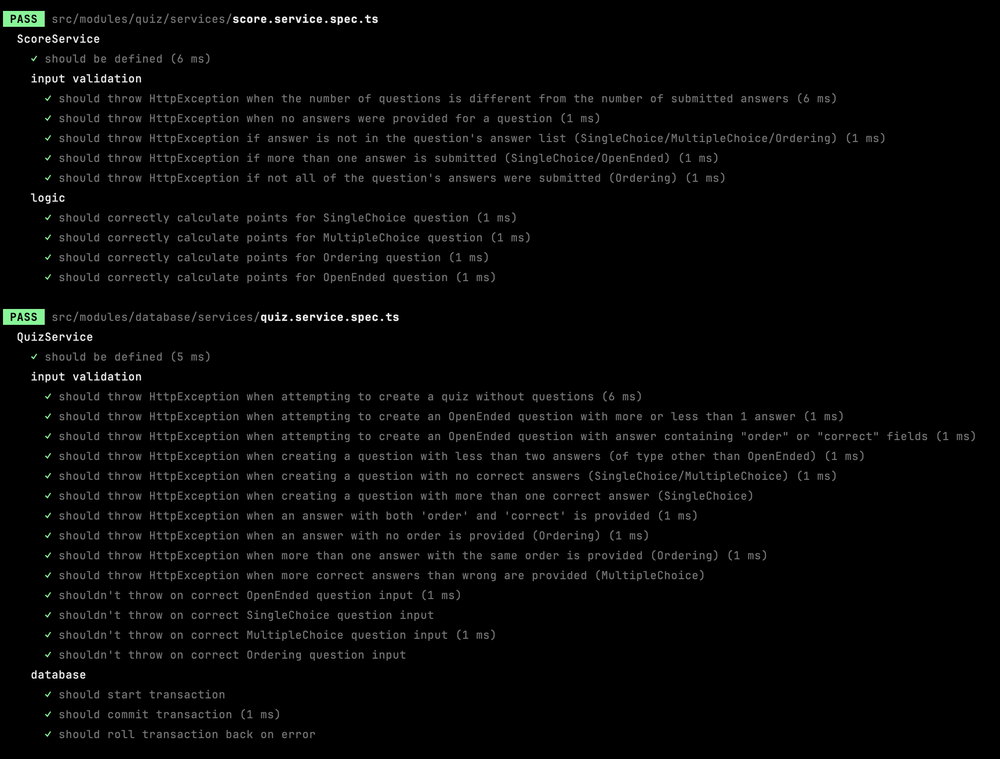

# Launching the app

To launch the app, use:
```bash
docker-compose up
```

Ensure the docker service is running & docker-compose is installed beforehand.

# Quiz creation

The correct quiz creation input schema is as follows:

```ts
{
  name: string;
  description: string;
  questions: {
    description: string;
    points: number;
    type: QuestionType; // (SingleChoice/MultipleChoice/Ordering/OpenEnded) 
    answers: {
      description: string;
      order?: int;
      correct?: boolean;
    }[];
  }[];
};
```
⚠️ Apart from the above schema, there are the following **rules**:
1. A quiz must have at least one question.
2. A question must have at least one answer.
3. `SingleChoice`, `MultipleChoice`, and `Ordering` questions must have at least two answers.
4. `OpenEnded` questions must have exactly one answer. 
5. An answer cannot have both `order` and  `correct` properties.
6. `OpenEnded` question answers must not have neither `order` nor `correct` properties.
7. `MultipleChoice` questions must not have more `correct: true` answers than `correct: false` answers.
8. `MultipleChoice` questions must have at least one `correct: true` answer.
9. `SingleChoice` questions must have exactly one `correct: true` answer.
10. `Order` question answers must have the `order` property.
11. `Order` question answers must have unique `order` (no two answers can have the same `order`);

# Checking score

The correct input schema to check score looks as follows:

```ts
{
  quizId: string; // the id of the quiz we want to check against
  answers: {  
    answerDescriptions: string[]; //the array of all the descriptions of answers for the question 
  }[]; // answers[i] is an answer for questions[i]
};
```

⚠️ Again, on top of that, there are rules:

1. The number of submitted answers must match the number of questions.
2. Each question must have at least one answer submitted.
3. Answers submitted must be from the question's answer list for `SingleChoice`, `MultipleChoice`, and `Ordering` questions.
4. Only one answer can be submitted for `SingleChoice` and `OpenEnded` questions.
5. All answers from the question's answer list must be submitted for `Ordering` questions.

### How are scores calculated?

1. `SingleChoice` - full question points if the correct answer was selected
2. `MultipleChoice` - `(correctAnswers - incorrectAnswers)/totalCorrectAnswers * points` 
3. `Ordering` - full score if the order was right
4. `OpenEnded` - full score if the string inputted is the same, 
save for whitespace variations, punctuation and capitalization (see in the example section below, the model answer is `"Kaiser."`,
but `"kaiser!!!!!!!!!!"` is a correct answer too).

# Examples

## `createQuiz(quiz: CreateQuizInput)`

```graphql
mutation {
    createQuiz(quiz: {
        name: "World War I Knowledge",
        description: "A quiz testing knowledge about WW1"
        questions: [
            {
                description: "Where did World War I start?",
                points: 1,
                type: SingleChoice
                answers: [
                    {
                        correct: true
                        description: "Sarajevo."
                    },
                    {
                        correct:false
                        description: "Warsaw."
                    },
                    {
                        correct: false
                        description: "Berlin."
                    }
                ]
            },
            {
                description: "Which countries took part in WW1?",
                points: 2,
                type: MultipleChoice
                answers: [
                    {
                        correct: true
                        description: "Russia"
                    },
                    {
                        correct:false
                        description: "South Africa"
                    },
                    {
                        correct: true
                        description: "Germany"
                    },
                    {
                        correct: false,
                        description: "Zimbabwe"
                    }
                ]
            },
            {
                description: "Assemble WW1 events in order:"
                points: 2
                type: Ordering
                answers: [
                    {
                        order: 4
                        description: "Treaty of Versailles is signed."
                    },
                    {
                        order: 2
                        description: "Italy declares war on Austria-Hungary."
                    },
                    {
                        order: 1
                        description: "Archduke Franz Ferdinand is assassinated."
                    },
                    {
                        order: 3
                        description: "British and American forces enter Germany."
                    }
                ]
            },
            {
                description:"What did the Germans call their emperor?"
                points: 1
                type: OpenEnded
                answers: [
                    {
                        description: "Kaiser."
                    }
                ]
            }

        ]
    }) {
        id
        name
        description
        questions {
            id
            description
            points
            type
            answers {
                id
                correct
                order
                description
            }
        }
    }
}
```

The above query creates the following quiz:

### World War I Knowledge
#### A quiz testing knowledge about WW1

1. Where did World War I start? (choose one)
   - Sarajevo.
   - Warsaw.
   - Berlin.
2. Which countries took part in WW1? (choose multiple)
    - Russia
    - South Africa
    - Germany
    - Zimbabwe
3. Assemble WW1 events in order:
    1. Treaty of Versailles is signed.
    2. Italy declares war on Austria-Hungary.
    3. Archduke Franz Ferdinand is assassinated.
    4. British and American forces enter Germany.
4. What did the Germans call their emperor?
   - ――――――――――――― (type your answer)

## `score(quizId: ID, answers: [SubmitAnswersForQuestionInput])`

```graphql
query {
    score(
        quizId: "32a6ee60-b35d-4351-bb13-fa06b1a7be54", 
        answers: 
        [
            {
                answerDescriptions: [
                    "Sarajevo."
                ]
            },
            {
                answerDescriptions: [
                    "Russia",
                    "Germany"
                ]
            },
            {
                answerDescriptions: [
                    "Archduke Franz Ferdinand is assassinated.",
                    "Italy declares war on Austria-Hungary.",
                    "British and American forces enter Germany.",
                    "Treaty of Versailles is signed."
                ]
            },
            {
                answerDescriptions: ["kaiser!!!!!!!!"]
            }
        ]
    ) {
        scored
        outOf
    }
}
```

The above object contains the correct answers to the example quiz above (**ID of course varying**). The mutation yields
the `{ scored: number, outOf: number }` object, in this case:
```ts
{
  scored: 6,
  outOf: 6
}
```

# Helper queries

You can fetch all quizzes using:

```graphql
query {
    quizzes {
       id
       name
       description
       questions {
          id
          description
          points
          type
          answers {
             id
             correct
             order
             description
          }
       } 
    }
}
```

You can fetch a quiz by ID using:

```graphql
query {
    quiz(id: "the ID of my quiz") {
       id
       name
       description
       questions {
          id
          description
          points
          type
          answers {
             id
             correct
             order
             description
          }
       } 
    }
}
```

This is of course also the way to fetch all questions for a qiven quiz.

# Unit test coverage

When it comes to the application logic, all of it is inside `QuizService` (creation of quizzes)
and `ScoreService` (calculating scores).



Input validation has been covered for both, database safety for `QuizService` and the
correctness of logic behind calculating scores in `ScoreService`.

# Disclaimer

You might've found the use of `question.description` as answer transportation method instead of `question.id` 
weird and impractical, however this was done for the purpose of readability when playing with the graphql query
editor. In a real application, sending the IDs to the backend would be more practical.


